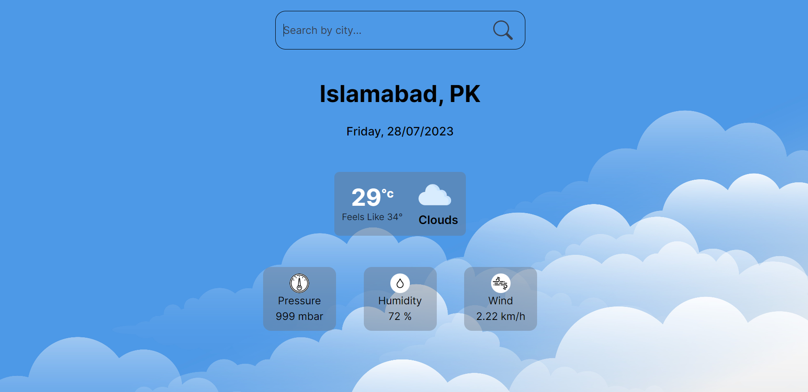
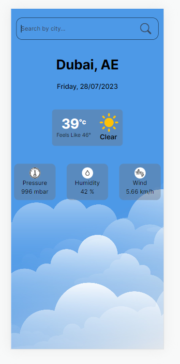

This is a [Next.js](https://nextjs.org/) project bootstrapped with [`create-next-app`](https://github.com/vercel/next.js/tree/canary/packages/create-next-app).

## Getting Started
First, install node_module,
secondly, run the development server:
```bash
#To install node_module
npm install
#To run development server
npm run dev
# or
yarn dev
# or
pnpm dev
```

## Technologies Use:
- NextJS
- ReactJS
- Typescript
- React Hooks (useState, useEffect)
- OpenWeatherApi key
- Redux for state Management
- Axios to fetch API data

## ScreenShots: Output:
#### Desktop view:

#### Mobile view:


## Learn More

To learn more about Next.js, take a look at the following resources:

- [Next.js Documentation](https://nextjs.org/docs) - learn about Next.js features and API.
- [Learn Next.js](https://nextjs.org/learn) - an interactive Next.js tutorial.

You can check out [the Next.js GitHub repository](https://github.com/vercel/next.js/) - your feedback and contributions are welcome!

## Deploy on Vercel

The easiest way to deploy your Next.js app is to use the [Vercel Platform](https://vercel.com/new?utm_medium=default-template&filter=next.js&utm_source=create-next-app&utm_campaign=create-next-app-readme) from the creators of Next.js.

Check out our [Next.js deployment documentation](https://nextjs.org/docs/deployment) for more details.
